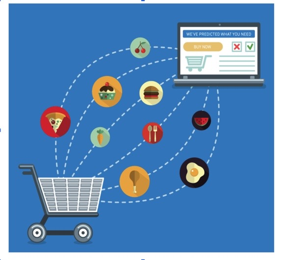
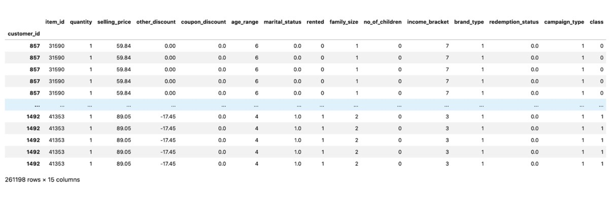
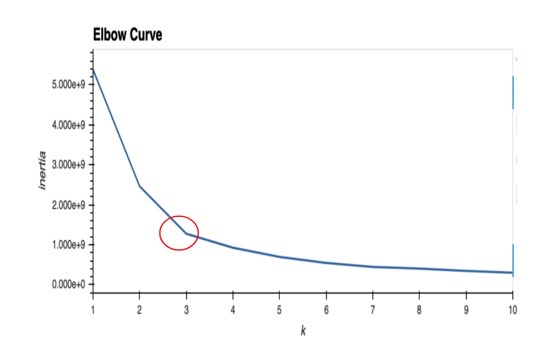

# CouponQuest Using Machine Learning 

## By: Carla Herrera, Aidan Thomas & Rena Tabal 

### Motivation & Hypothesis 

Question: Can machine learning models be used to predict if certain consumers will use coupons based on specific demographic features (i.e. age range, income bracket) ?

Hypotheses: 
We expected to see clear distinctions between customers:
Older consumers use coupons more than younger consumers (40+)
Consumers with a higher income use less coupons ($80k)
Coupons marketed via email are more successful with a younger age group (<35)
Coupons marketed via regular mail (flyers) are more successful with an older consumer 

### Preliminary Data Analysis 

Before we started cleaning our data and testing models, we took a quick glance at our data sets to see if any trends were visible. 

Initial Insights:
1. Consumers aged 46-55 use the most coupons 
2. Most people using coupons are married 
3. Most people using coupons are renting
4. Wealthier consumers generally use less coupons 

### Snapshot of our Data

### Data Challenges

1. Splitting Data: Incorrect usage of train-test-split method with our unsupervised models; we discovered our models didn’t require this step based on the outcomes we were looking for 
2. Imbalanced Data: While using features importance and principle components analysis (PCA) we discovered that one of our features was responsible for predicting most of the variance from the model
3. Slow Processing: Lots of computing power required for our notebooks. 
GitHub unhappy with the size of our dataset (LFS - large file account storage required) resulting us reducing the size of our dataset.

### Model Evaluations - Random Forest 

- The reason we chose a Random Forest model is because we knew we wanted a classification model to predict coupon redemption status
- Imbalanced dataset resulted in using SMOTE oversampling method first 
- Accuracy score = 93% 

- Random Forests in sklearn will automatically calculate feature importance and we used this method to determine the top 5 features for our dataset

### Model Evaluation - K-Means Using Principal Component Analysis 

- The second part of our project was to create customer segmentations, for this we used a K-means model hoping that we would get very clear clusters 
- Before we could do that we ran our data through the elbow curve method to try and determine the number of clusters that would give us a clearer picture of the customer segments.
- Determined that 3 clusters would work best 

- When we were plotting our insights it remained very unclear, so we continued to experiment with different sizes of k  to see if this would better define our clusters

- To help us understands our insights even further we wanted to see if we could reduce the number of variables we had without losing any information, so we ran a principal component analysis on our model. 
- Through this we were able to identify that one variable in our datasets accounts for most of the variance, 16% 
- We calculated the PCA for the top 3 components to see if we could drop and unnecessary data and clean up our insights further

