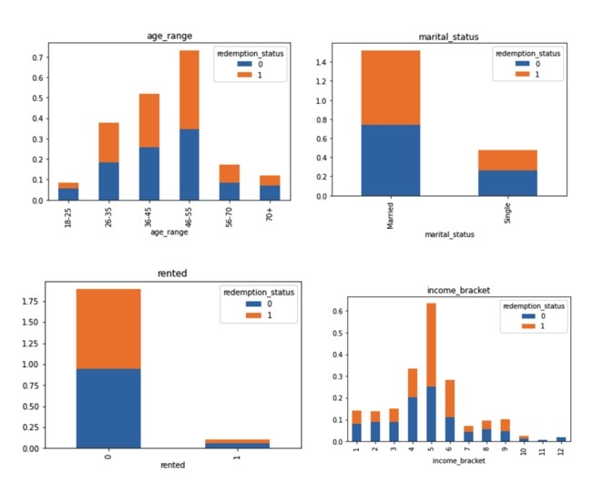

# CouponQuest Using Machine Learning 

## By: Carla Herrera, Aidan Thomas & Rena Tabal 

### Motivation & Hypothesis 

#### Context: 
Discount marketing and coupons are widely used promotional techniques
The measurement of a consumer’s propensity towards coupon usage and the prediction of the redemption behaviour can be used to assess the effectiveness of marketing campaigns

#### Question: Can machine learning models be used to predict if certain consumers will use coupons based on specific demographic features (i.e. age range, income bracket) ?

#### Hypotheses: 
We expected to see clear distinctions between customers:
Older consumers use coupons more than younger consumers (40+)
Consumers with a higher income use less coupons ($80k)
Coupons marketed via email are more successful with a younger age group (<35)
Coupons marketed via regular mail (flyers) are more successful with an older consumer 

### Preliminary Data Analysis 

Before we started cleaning our data and testing models, we took a quick glance at our data sets to see if any trends were visible. 

#### Initial Insights:
1. Consumers aged 46-55 use the most coupons 
2. Most people using coupons are married 
3. Most people using coupons are renting
4. Wealthier consumers generally use less coupons 

### Snapshot of our Data

<<<<<<< HEAD

=======

>>>>>>> 7c640e21e799a23b23abbb5d239de5d8aee3f1c5

### Data Challenges

1. Splitting Data: Incorrect usage of train-test-split method with our unsupervised models; we discovered our models didn’t require this step based on the outcomes we were looking for 
2. Imbalanced Data: While using features importance and principle components analysis (PCA) we discovered that one of our features was responsible for predicting most of the variance from the model
3. Slow Processing: Lots of computing power required for our notebooks. 
GitHub unhappy with the size of our dataset (LFS - large file account storage required) resulting us reducing the size of our dataset.

### Model Evaluations - Random Forest 

- The reason we chose a Random Forest model is because we knew we wanted a classification model to predict coupon redemption status
- Imbalanced dataset resulted in using SMOTE oversampling method first 
- Accuracy score = 93% 

- Random Forests in sklearn will automatically calculate feature importance and we used this method to determine the top 5 features for our dataset

### Model Evaluation - K-Means Using Principal Component Analysis 

- The second part of our project was to create customer segmentations, for this we used a K-means model hoping that we would get very clear clusters 
- Before we could do that we ran our data through the elbow curve method to try and determine the number of clusters that would give us a clearer picture of the customer segments.
- Determined that 3 clusters would work best 

- When we were plotting our insights it remained very unclear, so we continued to experiment with different sizes of k  to see if this would better define our clusters

- To help us understands our insights even further we wanted to see if we could reduce the number of variables we had without losing any information, so we ran a principal component analysis on our model. 
- Through this we were able to identify that one variable in our datasets accounts for most of the variance, 16% 
- We calculated the PCA for the top 3 components to see if we could drop and unnecessary data and clean up our insights further

<<<<<<< HEAD

=======

>>>>>>> 7c640e21e799a23b23abbb5d239de5d8aee3f1c5

- We decided to plot the two PCA’s with the highest variance because we thought it would be a good approximation of what’s happening in the data 
- Together these principal components account for 27% of the variance in the data which us not very high and thus makes it difficult to infer further insights 
- Note: We changed the axes of PCA1 and PCA2 to make the separation of clusters easier to understand. However, we interpret this as some clustering happening but the results are inconclusive to us (see plot below). 

<<<<<<< HEAD

=======

>>>>>>> 7c640e21e799a23b23abbb5d239de5d8aee3f1c5

### Model Evaluations - BIRCH (Balanced Iterative Reducing and Clustering Using Hierarchies)

- BIRCH is a new model we explored 
- It is an unsupervised, clustering algorithm; provides a memory-efficient method for clustering large datasets without scanning all points in a dataset 
- As we did not have defined X and y features, the Silhouette Coefficient Score evaluation metric was performed using the model itself 
- Higher Silhouette Coefficient score relates to a model with better defined, dense, well separated clusters. 

#### Silhouette Score: 
The silhouette score is calculated by taking the difference of the average distance between a data point and all other data points in the cluster it belongs to (a) & the minimum average distance from the data point to the clusters it does not belong to (b) all divided by the maximum of these two values.
Experimenting with different numbers of clusters and analyzing the silhouette scores for them reveals for both models our optimum number of clusters is two. Refer to below table of results. 

<<<<<<< HEAD

=======

>>>>>>> 7c640e21e799a23b23abbb5d239de5d8aee3f1c5

### Final Thoughts 

1. Although our intention was to try and define specific clusters of customer characteristics to determine consumer behaviour, we were unable to come to any definitive conclusions.

2. Unsupervised models are difficult to work with because we weren’t able to define our features although we had assumptions of what might be most relevant; instead we were running the entire dataset through the model allowing it to decide the features on its own. 

3. Overall, we spent a lot of time trying to plot and interpret the outputs of our clustering models.

### Postmortem

#### Discuss any difficulties that arose, and how you dealt with them.
- Forcing conclusions where there may have been inconclusive outputs from our data 
- Constantly revisiting the purpose of our models, model testing and analysis
- Lots of computing power required for our notebooks, resulting in a long wait time for outputs. We weren’t sure what the data required and may have been able to split up data, instead we ran the entire dataset/dataframe. Had we known the models would take so long we would have split them up into to smaller portions, unfortunately we ran out of time.

#### Discuss any additional questions or problems that came up but you didn't have time to answer: What would you research next if you had two more weeks?
- So many models to explore, too little time 
- t-SNE (t-distributed stochastic neighbor embedding), another technique for dimension reduction and is well suited for the visualization of high dimensional datasets 

